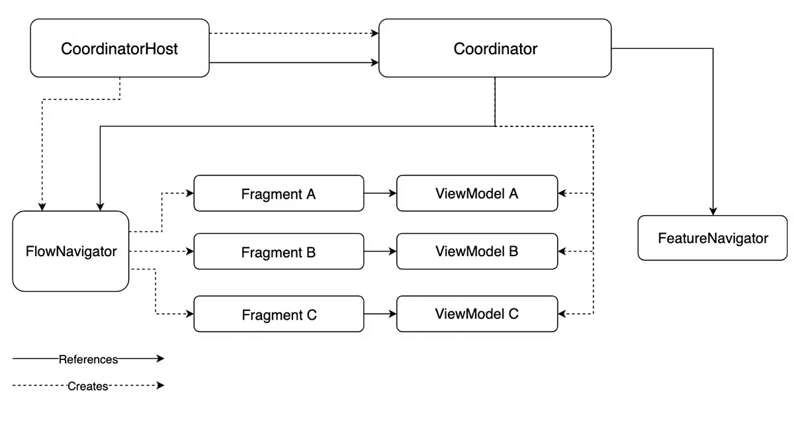

# Android coordinator pattern

This is a sample coordinator pattern implementation based on [this article](https://monzo.com/blog/coordinators-on-android-building-flows-quickly-with-reusable-screens) from Monzo.

_Below diagram illustrating the coordinator pattern is from the above linked article._
